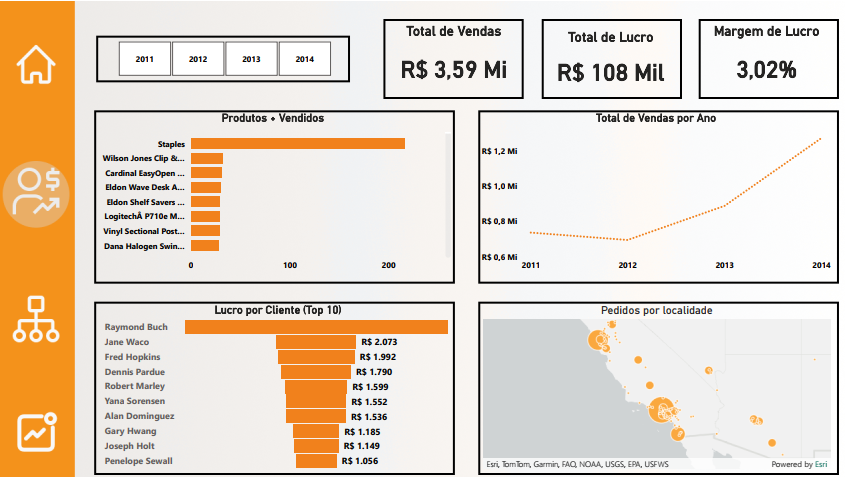

# Projeto: Dashboard Amazon - Análise de Vendas e Lucratividade

### ➡️ Análise Detalhada e Dashboard Interativo no Meu Portfólio:
[Acesse a página completa do projeto aqui](https://ferreiragabrielw.github.io/portfolio-gabriel/projetos/Dashboards/6DadosAmazonSales/Projeto6DA.html)

---

## Sobre o Projeto

Este dashboard simula o ambiente de e-commerce e varejo da **Amazon**, oferecendo uma visão detalhada do desempenho financeiro, produtos mais rentáveis, comportamento de compra do cliente e eficiência operacional (tempo de entrega). Desenvolvido em **Power BI**, ele capacita a gestão a tomar decisões estratégicas de estoque, precificação, marketing e otimização da cadeia de suprimentos.

## Tecnologias e Processo

* **Ferramentas**: Power BI Desktop (DAX, M), Figma (prototipação e design), Microsoft Excel (fontes de dados).
* **ETL**: Dados extraídos de uma única planilha Excel (`.xls`), transformados no Power Query e modelados para análise multidimensional.

## Conteúdo do Repositório

* `data/`: Base de dados (Excel) utilizada.
* `powerbi/`: Arquivo `.pbix` do dashboard Power BI.
* `figma/`: Arquivos relacionados ao protótipo e design no Figma.
* `README.md`: Este documento.
* `LICENSE`: Licença do projeto (MIT License).

## Como Visualizar

* **Online**: [Acesse o dashboard publicado no Power BI Service](https://app.powerbi.com/groups/me/reports/f3677347-a80f-4fd0-aad8-4a1b5c33b243/ReportSection45c8cf44a92cf66d802f?experience=power-bi)
* **Localmente**: Faça o download do arquivo `.pbix` na pasta `powerbi/` e abra-o com o Power BI Desktop.

---

### Licença

Este projeto está licenciado sob a [MIT License](LICENSE).